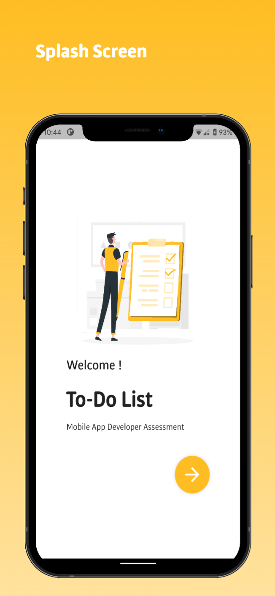
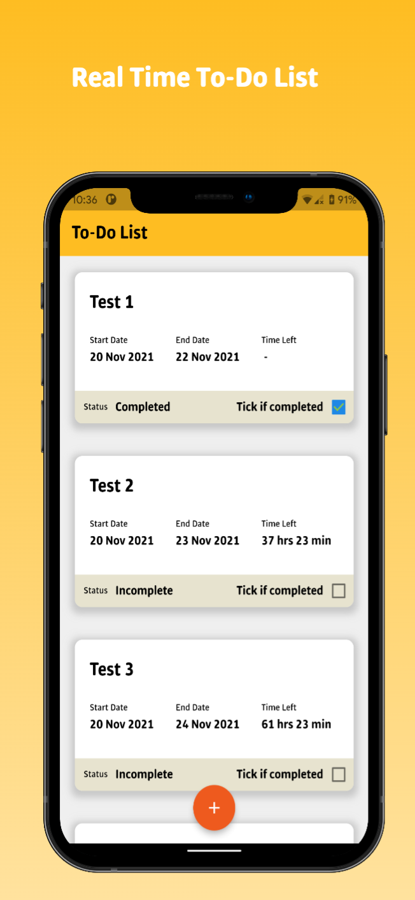
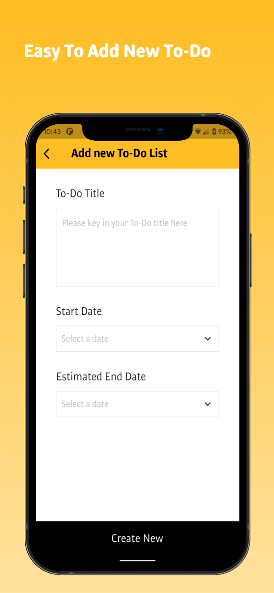
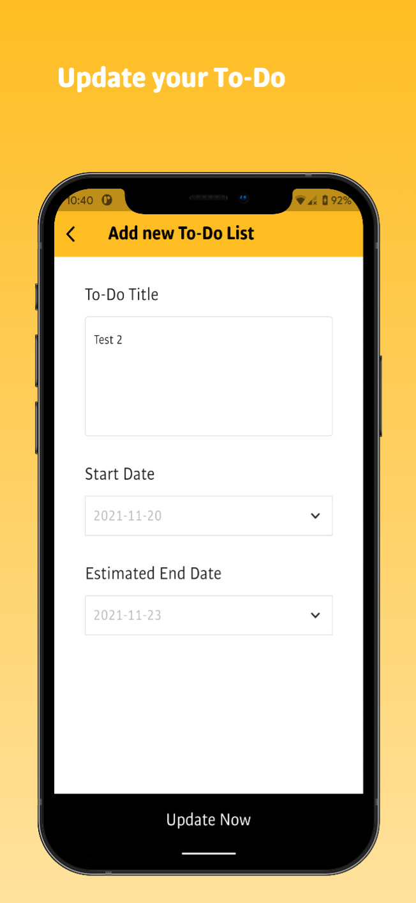

# TO-DO LIST APPS

Mobile App Developer Assessment by ETiQA IT

## Getting Started

This project is an assessment developed using Flutter with Dart language. This apps alsi built with sound null safety with the latest Flutter and Dart SDK

[Download APK sample here](sample/)

## Flutter Packages Used

This apps amazingly built with multiple of packages. Local storage and shared preferences used Hive, the fastest and secure NoSQL database. For state management, GetX is used for organized state management in the apps.

⚡ [get](https://pub.dev/packages/get)
🚀 [hive](https://pub.dev/packages/hive)
🔒 [intl](https://pub.dev/packages/intl)

### Author

This project was created by Haziq Shukor.

Hope you appreciate my work.

### Flutter
This project is a starting point for a Flutter application.

A few resources to get you started if this is your first Flutter project:

- [Lab: Write your first Flutter app](https://flutter.dev/docs/get-started/codelab)
- [Cookbook: Useful Flutter samples](https://flutter.dev/docs/cookbook)

For help getting started with Flutter, view our
[online documentation](https://flutter.dev/docs), which offers tutorials,
samples, guidance on mobile development, and a full API reference.

## License
[MIT](https://choosealicense.com/licenses/mit/)
